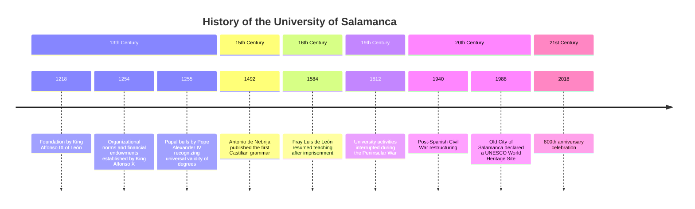

# Informe DGSI

## Teoria 1 (18/02/2025)
#### 1. Les decisions es prenen per política, no per eficiència

Els ideals extremistes no són la solució a la política. L'ultra dreta al ser tan conservadora i promoure poc la diversitat i progrés porta a la falta de canvi i, per tant, a la falta de creixement i de productivitat. Però l'extrema esquerra que només busca la revolució tampoc és la solució, ja que es destrueixen els medis de producció portant el país a la seva inevitable caiguda. Segons diversos factors com l'edat, el sexe, l'ètnia, etc. podem ser més progressites o conservadors, però no hem de perdre mai de vista la meta comuna que compartim tots: fer-ne del lloc on vivim un lloc millor.

#### 2. El creixement és necessari

Ara la pregunta que sorgeix és: per què necessitem un constant **creixement** perquè el país es mantingui funcionant? Les persones som inevitablement humanes, i per tant, volem veure millores en les nostres condicions, fet que no pot passar si no hi ha creixement.

Durant l'edat medieval on no hi va haver canvi durant un parell de milers d'anys els medis de producció es van estancar, no hi havia innovació ni creixement. Tot va seguir així fins que va arribar la **pesta negra** milions i milions de persones van morir i els senyors feudals es van quedar sense suficients servents per tractar les terres. A partir d'aquí és quan els medis de producció van començar a ser més productius i a incrementar el creixement que havia estat estancat durant tants anys.

Però el creixement es pot trobar d'altres maneres. Per exemple, antigament els vikings no pensaven en millorar els seus medis de producció, el que feien era invaïr altres territoris i agafar-lis els recursos per créixer. Avui dia sabem que els recursos que hi ha al món són limitats i que, per tant, aquesta estratègia mai serà la que ens farà prosperar fins a un futur.

#### 3. És el creixement imcompatible amb la sostenibilitat?

Fins fa uns anys el creixement estava directament lligat amb el consum de recursos, hi havia una dependència lineal entre la gràfica del creixement i del consum de recursos. Com bé sabem, necessitem constantment un **creixement anual** per mantenir el país, però si mirem la seva gràfica ens donarem compte que això equival a una **gràfica exponencial**. És a dir, que si el creixement creix exponencialment, també ho fa la gràfica del consum de recursos.

L'exemple més clar són les cintes i DVDs que antigament es llogaven o compraven al *videoclub* del costat de casa. Necessitaven molts materials, molta mà d'obra i la major part del temps acabarien sense fer-se servir un cop vist la pel·lícula.

Tot i que a primera vista la sostenibilitat i el creixement semblin completament incompatibles, realment la solució és ben fàcil. El que hem de fer és deslligar una gràfica de l'altra, fer que el creixement no sigui **linealment proporcional** al consum de recursos.

Tornant a l'exemple anterior del local on es llogaven pel·lícules, ara no fa falta consumir tants recursos per poder veure la pel·lícula en qüestió. Actualment amb Netflix que està al *cloud* el consum de recursos ha baixat moltíssim. Estem fent una transició en què el que es ven no són **productes** sinó que són **serveis**, i d'aquesta manera aconseguim reduir aquesta dependència clara que teníem entre sostenibilitat i creixement, que inicialment semblaven directament proporcionals i que no hi havia manera de superar-ho.

## Lab 1 (20/02/2025)
Hem fet una pàgina web que rep un audio i transcriu la veu a text indicant qui ho ha dit usant dues IAs, una per la transcripció i una altra per detectar cada persona. La organització es diu [DGSI-UPC](https://github.com/DGSI-UPC) i el projecte en concret és [aquest](https://github.com/DGSI-UPC/Subtitle-Generator).

## Teoria 2 (25/02/2025)
#### 1. Pila tecnològica
Tota empresa té la seva **pila tecnològica** que sosté els seus fundaments. Per evitar que aquesta caigui, les bases han de ser ben sòlides i no han de dependre d'una sola persona, com va passar amb Internet sent sostingut per un senyor que vivia a Minnesota als anys 80.

Moltes decisions es prenen per **raons polítiques**. En una empresa, sobretot en les més grans, és impossible que no hi hagi política de per mig. Una empresa o organització implica la presència de diferents persones amb diferents interessos, fent que algunes decisions no es facin en base a l'eficiència o decisions *correctes* sinó en base a aquests interessos.

Un bon exemple d'això és l'aplicació d'*smart city* a Barcelona, la qual no s'està reformant per a millorar el trànsit dels vehicles sinó per a fer més difícil el trànsit de cotxes. Aplicant la política a una situació més tècnica, els productes obsolets de les empreses no es tornen a programar no pel temps que es tardaria en programar sinó per la complexitat del problema en sí. A això se l'anomena ***wicked problem***, un problema molt complex.

També n'és un exemple la plataforma de la seguretat social d'Estats Units feta amb Cobol, un llenguatge que va néixer el 1959 i que presenta moltes vulnerabilitats, com per exemple havent-hi persones de 150 anys cobrant una jubilació que no els hi pertoca (essent clarament una estafa). No és que els programadors que hi ha no siguin capaços de programar-ho un altre cop, sinó que no hi ha ningú que tingui els requeriments ben clars del que s'ha de tenir. **No és un problema de programació, sinó un problema polític**.

### 2. Importància de l'alineació d'interessos
Precisament per aquest fet considero que prendre decisions és una tasca molt important que comporta molta responsabilitat, ja que determinarà el futur d'una empresa o organització. Fer-ho de la millor manera possible pensant en el seu futur fent servir la tecnologia més adequada i, si és possible, més moderna, és el més important.

Per **alinear els interessos** dels empleats se'ls hi dóna una posició que impliqui la col·laboració entre ells. Per exemple, anomenant als empleats que despleguen les aplicacions *DevOps* aconseguim que treballin amb els desenvolupadors de l'aplicació per a fer-la funcionar adequadament en el desplegament.

## Lab 2 (27/02/2025)
Hem creat una pàgina web que admet una URL pública. A partir d'aquesta URL investiga tots els links relacionats amb aquesta i llegeix els seus continguts per retornar-los en un Markdown bucket. El link al projecte és [aquest](https://github.com/DGSI-UPC/Web-to-Markdown).

## Teoria 3 (4/3/2025)
És molt important mantenir els programes per evitar l'obsolescència ja que els requeriments sempre canvien contínuament. El legacy code està en totes les empreses però a vegades és necessari mantenir-les perquè és l'únic codi que compleix aquesta necessitat. Això és el que passa actualment amb els ponts del Baix Llobregat i de Budapest.

Une exemple de canvi de requisits és la matrícula de la FIB. Antigament es necessitaven setmanes per fer la matrícula, ara amb l'automatrícula només en un matí ja poden estar tots els estudiants matriculats.

Com hem vist, saber els requisits que tindrà el codi és el més important de tot. Tot i així, no sempre és fàcil entendre'ls o explicar-los. En una empresa quan un client t'ha d'explicar el que vol és difícil entendre-ho perquè no sap res de tecnologia: són *mugglers*. PEr contrapartida, tu també ets un *muggler* per a ell, ja que tu no saps res de com funciona la seva empresa o la seva manera de fer negoci. És un problema de comunicació.

Com els requisits i la tecnologia van canviant molt ràpidament no es pot aplicar el sistema *waterfall*, de manera que el 1998 es va crear la metodologia *agile*. Consisteix en fer un equip tots junts el client i el teu equip de l'empresa per tenir experiències conjuntes i entendre millor a l'altra persona.

A partir d'agile va néixer SCRUM, el qual és un procés i per tant és molt poc eficient. No està pensat per ser eficient, sinó per controlar els treballadors. Amb això estic d'acord fins a cert punt, perquè haver d'escriure tickets, fer 10 mil reunions i tot és molt poc eficient i un pal. Però tenir un lloc on quedin clares les tasques que s'han de fer per seguir amb el projecte i saber quin company fa cada cosa per no repetir codi o treballar conjuntament.

## Lab 3 (6/3/2025)
Hem creat un programa que rep un text i n'indexa els continguts fent servir una IA d'embeddings. Aquest embeddings es guarden a chromaDB per a després poder buscar en aquesta base de dades. El model de IA que hem fet servir és text-embedding-3-small. El link del projecte és [aquest](https://github.com/DGSI-UPC/ChromaDB-Embedding).

## Teoria 4 (11/3/2025)

### 1. Skin in the Game
El concepte de "Skin in the game" es fa evident en l'exemple dels romans arquitectes que dissenyaven ponts i els arquitectes de Babilònia. Aquests tenien una responsabilitat crucial pel disseny de les cases: si una casa dissenyada per un arquitecte babilònic causava la mort del fill del propietari, l'arquitecte era executat. Aquesta responsabilitat personal vinculada al seu treball reflecteix la idea que els professionals que prenen decisions també haurien de tenir un interès directe en els resultats d'aquestes decisions.

En la crisi del 2008 a Espanya el govern va salvar als bancs per tal que el país no s’enfonsés, però a canvi no es va investigar per trobar els culpables ni la causa d’aquesta caiguda. D’aquesta manera, els banquers no tenien skin in the game, i això fa que en un futur, assegurat, una cosa com aquesta tornarà a passar, perquè ningú ha patit les males conseqüències d’aquestes decisions.

D’aquí en podem extreure dos conceptes principals: els compromesos i els implicats. Una persona implicada seria un manager que porta diferents projectes, però una persona compromesa té skin in the game.

### 2. Dades versus Informació
L’exemple del semàfor és el més fàcil d’entendre per explicar la diferència entre dades i informació. Es poden distingir diversos components que formen la informació completa:

| **Terme** | **Descripció** |
|---------------|----------------|
| **Dades** | Un semàfor taronja. |
| **Regles** | En un semàfor taronja, segons el codi de circulació, s'ha de parar. |
| **Context** | La interpretació del semàfor taronja varia depenent de la situació, com ara si hi ha càmera de trànsit o si estem a Alemanya. |
| **Memòria** | A Alemanya, els conductors tendeixen a respectar sempre els semàfors. |
| **Informació** | La informació inclou no només les dades (semàfor taronja), sinó també les regles a seguir, el context en què s'apliquen i la memòria sobre com els conductors actuen basant-se en experiències prèvies. |

Així, les dades per si soles no són suficients per guiar una acció, sinó que cal el conjunt de regles, context i memòria per crear una veritable informació útil.

### 3. Auditoria de Títols i la Validació Internacional
En el passat, per garantir que els títols acadèmics fossin vàlids en altres països europeus, existien convenis entre universitats per reconèixer-los mútuament. Aquesta pràctica assegurava que els títols obtinguts en un país fossin acceptats en altres regions, facilitant la mobilitat laboral i acadèmica a nivell europeu. L'auditoria de títols es referia a aquest procés de revisió i validació, que garantitzava que els títols complien els estàndards internacionals.

En l'actualitat, la qualitat de l'educació i els títols s'assegura mitjançant estàndards, tests i certificacions, que són fonamentals per assegurar la seva validesa a nivell global. Això permet una millor integració i reconeixement de les formacions professionals entre diferents països.

### 4. Organització d'Empresa: Bar de la Fib
La gestió i organització d'una empresa poden veure's reflectides en el model d'un bar, com seria el cas del Bar de la FIB (Facultat d'Informàtica de Barcelona). En aquest entorn, la gestió empresarial es fa d'una manera col·laborativa, on cada membre de l'equip té responsabilitats definides i l'objectiu comú és l'èxit del negoci. Les dinàmiques internes de l'organització es poden estudiar mitjançant el model d'un bar, on la coordinació, l'estructura i la responsabilitat de cada element dins l'organització són essencials per al bon funcionament.

## Lab 4 (13/3/2025)
Hem fet un chatbot que funciona per línia de comandes que rep preguntes sobre la FIb i les respon. Ho fa gràcies al **RAG** (Retrieval Augmented Generation) que hem creat fent servir la pràctica anterior, que consistia en indexar la informació de la pàgina web de la FIB en chromaDB i obtenir-la en format markdown. Per més informació visitar aquest [link](https://github.com/DGSI-UPC/llm-chat-rag).

## Teoria 5 (18/3/2025)
### 1. Empresa
- Missió / Visió
- Objectius
- Estructura / Organigrama
- Política (jerarquia / autonomia / incentius / retribucions)
- Sistema d'informació
- Actors (inters/externs)
- Fluxos d'informació
- **Magatzems d'informació**

### 2. Magatzems d'informació
Abans es feien servir fluxos i magatzems d'informació estructurats: les bases de dades **SQL**. El seu principal objectiu era la integritat, de manera que és molt lent perquè es fan servir operacions atòmiques (locks). A partir d'això van aparèixer les bases de dades **NoSQL** que són ràpides i escalables. Ja no hi ha normalització i es podria haver fet amb SQL, però la gent no ho entenia i acabaven normalitzant igualment. D'aquesta manera, es fa servir SQL quan es demana integritat (comprar un bitllet d'avió) però quan la rapidesa és el més important (búsqueda de bitllets) llavors NoSQL és millor.

### 3. L'eficiència no ho és tot
Hi ha casos en què l'eficiència no és el més important, per exemple quan fiquem un rentavaixelles no dividim els coberts en tipus per després guardar-los fàcilment. Això passa també amb eines d'automatització com Python, no és el llenguatge més ràpid i eficient, però per executar poques línies de codi un o dos cops a la setmana és més que suficient.

## Lab 5 (20/3/2025)
Hem estudiat enginyeria de prompting per poder crear prompts consistents i bons perquè els LLMs ho entenguin.
- Ser específic
- Ficar exemples
- Demanar alguna cosa
- Formatejar el prompt
- Demanar-li que ho faci pas per pas

Seguint aquestes directrius li hem demanat a un LLM que ens faci el codi Mermaid (format per a dissenyar grafs i diagrames des de text) de la *timeline* de la Universitat de Salamanca.

```
create Mermaid.js code to create a Timeline Diagram. this Timeline Diagram must reflect the history of the university of salamanca, and to do this you need to follow the following steps:

—
1. find a website like wikipedia and identify the most relevant events with their corresponding date
2. place the date of these events correctly in the Timeline Diagram using the date the event happened
3. place the corresponding century for each date
4. create the corresponding Mermaid.js code
—

write all the steps you are following to complete this task
```

I obtenim aquesta resposta:



Al RAG que teníem de pràctiques anteriors li hem afegit un glossari de termes de la FIB perquè a la hora de buscar sigles d'assignatures (DGSI) o de termes específics de la universitat (ECTS) entengui de què estem parlant. El link al projecte és el mateix que el lab anterior: [link](https://github.com/DGSI-UPC/llm-chat-rag).

## Teoria 6 (25/3/2025)

## Lab 6 (27/3/2025)