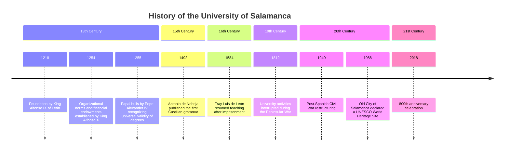
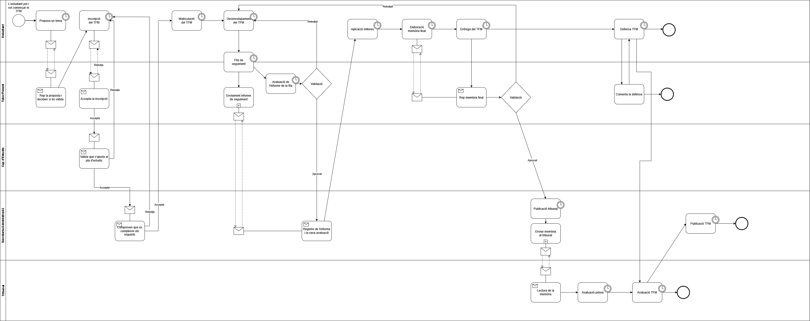

# Informe DGSI

## Teoria 1 (18/02/2025)
#### 1. Les decisions es prenen per política, no per eficiència

Els ideals extremistes no són la solució a la política. L'ultra dreta al ser tan conservadora i promoure poc la diversitat i progrés porta a la falta de canvi i, per tant, a la falta de creixement i de productivitat. Però l'extrema esquerra que només busca la revolució tampoc és la solució, ja que es destrueixen els medis de producció portant el país a la seva inevitable caiguda. Segons diversos factors com l'edat, el sexe, l'ètnia, etc. podem ser més progressites o conservadors, però no hem de perdre mai de vista la meta comuna que compartim tots: fer-ne del lloc on vivim un lloc millor.

#### 2. El creixement és necessari

Ara la pregunta que sorgeix és: per què necessitem un constant **creixement** perquè el país es mantingui funcionant? Les persones som inevitablement humanes, i per tant, volem veure millores en les nostres condicions, fet que no pot passar si no hi ha creixement.

Durant l'edat medieval on no hi va haver canvi durant un parell de milers d'anys els medis de producció es van estancar, no hi havia innovació ni creixement. Tot va seguir així fins que va arribar la **pesta negra** milions i milions de persones van morir i els senyors feudals es van quedar sense suficients servents per tractar les terres. A partir d'aquí és quan els medis de producció van començar a ser més productius i a incrementar el creixement que havia estat estancat durant tants anys.

Però el creixement es pot trobar d'altres maneres. Per exemple, antigament els vikings no pensaven en millorar els seus medis de producció, el que feien era invaïr altres territoris i agafar-lis els recursos per créixer. Avui dia sabem que els recursos que hi ha al món són limitats i que, per tant, aquesta estratègia mai serà la que ens farà prosperar fins a un futur.

#### 3. És el creixement imcompatible amb la sostenibilitat?

Fins fa uns anys el creixement estava directament lligat amb el consum de recursos, hi havia una dependència lineal entre la gràfica del creixement i del consum de recursos. Com bé sabem, necessitem constantment un **creixement anual** per mantenir el país, però si mirem la seva gràfica ens donarem compte que això equival a una **gràfica exponencial**. És a dir, que si el creixement creix exponencialment, també ho fa la gràfica del consum de recursos.

L'exemple més clar són les cintes i DVDs que antigament es llogaven o compraven al *videoclub* del costat de casa. Necessitaven molts materials, molta mà d'obra i la major part del temps acabarien sense fer-se servir un cop vist la pel·lícula.

Tot i que a primera vista la sostenibilitat i el creixement semblin completament incompatibles, realment la solució és ben fàcil. El que hem de fer és deslligar una gràfica de l'altra, fer que el creixement no sigui **linealment proporcional** al consum de recursos.

Tornant a l'exemple anterior del local on es llogaven pel·lícules, ara no fa falta consumir tants recursos per poder veure la pel·lícula en qüestió. Actualment amb Netflix que està al *cloud* el consum de recursos ha baixat moltíssim. Estem fent una transició en què el que es ven no són **productes** sinó que són **serveis**, i d'aquesta manera aconseguim reduir aquesta dependència clara que teníem entre sostenibilitat i creixement, que inicialment semblaven directament proporcionals i que no hi havia manera de superar-ho.

## Lab 1 (20/02/2025)
Hem fet una pàgina web que rep un audio i transcriu la veu a text indicant qui ho ha dit usant dues IAs, una per la transcripció i una altra per detectar cada persona. La organització es diu [DGSI-UPC](https://github.com/DGSI-UPC) i el projecte en concret és [aquest](https://github.com/DGSI-UPC/Subtitle-Generator).

## Teoria 2 (25/02/2025)
#### 1. Pila tecnològica
Tota empresa té la seva **pila tecnològica** que sosté els seus fundaments. Per evitar que aquesta caigui, les bases han de ser ben sòlides i no han de dependre d'una sola persona, com va passar amb Internet sent sostingut per un senyor que vivia a Minnesota als anys 80.

Moltes decisions es prenen per **raons polítiques**. En una empresa, sobretot en les més grans, és impossible que no hi hagi política de per mig. Una empresa o organització implica la presència de diferents persones amb diferents interessos, fent que algunes decisions no es facin en base a l'eficiència o decisions *correctes* sinó en base a aquests interessos.

Un bon exemple d'això és l'aplicació d'*smart city* a Barcelona, la qual no s'està reformant per a millorar el trànsit dels vehicles sinó per a fer més difícil el trànsit de cotxes. Aplicant la política a una situació més tècnica, els productes obsolets de les empreses no es tornen a programar no pel temps que es tardaria en programar sinó per la complexitat del problema en sí. A això se l'anomena ***wicked problem***, un problema molt complex.

També n'és un exemple la plataforma de la seguretat social d'Estats Units feta amb Cobol, un llenguatge que va néixer el 1959 i que presenta moltes vulnerabilitats, com per exemple havent-hi persones de 150 anys cobrant una jubilació que no els hi pertoca (essent clarament una estafa). No és que els programadors que hi ha no siguin capaços de programar-ho un altre cop, sinó que no hi ha ningú que tingui els requeriments ben clars del que s'ha de tenir. **No és un problema de programació, sinó un problema polític**.

### 2. Importància de l'alineació d'interessos
Precisament per aquest fet considero que prendre decisions és una tasca molt important que comporta molta responsabilitat, ja que determinarà el futur d'una empresa o organització. Fer-ho de la millor manera possible pensant en el seu futur fent servir la tecnologia més adequada i, si és possible, més moderna, és el més important.

Per **alinear els interessos** dels empleats se'ls hi dóna una posició que impliqui la col·laboració entre ells. Per exemple, anomenant als empleats que despleguen les aplicacions *DevOps* aconseguim que treballin amb els desenvolupadors de l'aplicació per a fer-la funcionar adequadament en el desplegament.

## Lab 2 (27/02/2025)
Hem creat una pàgina web que admet una URL pública. A partir d'aquesta URL investiga tots els links relacionats amb aquesta i llegeix els seus continguts per retornar-los en un Markdown bucket. El link al projecte és [aquest](https://github.com/DGSI-UPC/Web-to-Markdown).

## Teoria 3 (4/3/2025)
És molt important mantenir els programes per evitar l'obsolescència ja que els requeriments sempre canvien contínuament. El legacy code està en totes les empreses però a vegades és necessari mantenir-les perquè és l'únic codi que compleix aquesta necessitat. Això és el que passa actualment amb els ponts del Baix Llobregat i de Budapest.

Une exemple de canvi de requisits és la matrícula de la FIB. Antigament es necessitaven setmanes per fer la matrícula, ara amb l'automatrícula només en un matí ja poden estar tots els estudiants matriculats.

Com hem vist, saber els requisits que tindrà el codi és el més important de tot. Tot i així, no sempre és fàcil entendre'ls o explicar-los. En una empresa quan un client t'ha d'explicar el que vol és difícil entendre-ho perquè no sap res de tecnologia: són *mugglers*. PEr contrapartida, tu també ets un *muggler* per a ell, ja que tu no saps res de com funciona la seva empresa o la seva manera de fer negoci. És un problema de comunicació.

Com els requisits i la tecnologia van canviant molt ràpidament no es pot aplicar el sistema *waterfall*, de manera que el 1998 es va crear la metodologia *agile*. Consisteix en fer un equip tots junts el client i el teu equip de l'empresa per tenir experiències conjuntes i entendre millor a l'altra persona.

A partir d'agile va néixer SCRUM, el qual és un procés i per tant és molt poc eficient. No està pensat per ser eficient, sinó per controlar els treballadors. Amb això estic d'acord fins a cert punt, perquè haver d'escriure tickets, fer 10 mil reunions i tot és molt poc eficient i un pal. Però tenir un lloc on quedin clares les tasques que s'han de fer per seguir amb el projecte i saber quin company fa cada cosa per no repetir codi o treballar conjuntament.

## Lab 3 (6/3/2025)
Hem creat un programa que rep un text i n'indexa els continguts fent servir una IA d'embeddings. Aquest embeddings es guarden a chromaDB per a després poder buscar en aquesta base de dades. El model de IA que hem fet servir és text-embedding-3-small. El link del projecte és [aquest](https://github.com/DGSI-UPC/ChromaDB-Embedding).

## Teoria 4 (11/3/2025)

### 1. Skin in the Game
El concepte de "Skin in the game" es fa evident en l'exemple dels romans arquitectes que dissenyaven ponts i els arquitectes de Babilònia. Aquests tenien una responsabilitat crucial pel disseny de les cases: si una casa dissenyada per un arquitecte babilònic causava la mort del fill del propietari, l'arquitecte era executat. Aquesta responsabilitat personal vinculada al seu treball reflecteix la idea que els professionals que prenen decisions també haurien de tenir un interès directe en els resultats d'aquestes decisions.

En la crisi del 2008 a Espanya el govern va salvar als bancs per tal que el país no s’enfonsés, però a canvi no es va investigar per trobar els culpables ni la causa d’aquesta caiguda. D’aquesta manera, els banquers no tenien skin in the game, i això fa que en un futur, assegurat, una cosa com aquesta tornarà a passar, perquè ningú ha patit les males conseqüències d’aquestes decisions.

D’aquí en podem extreure dos conceptes principals: els compromesos i els implicats. Una persona implicada seria un manager que porta diferents projectes, però una persona compromesa té skin in the game.

### 2. Dades versus Informació
L’exemple del semàfor és el més fàcil d’entendre per explicar la diferència entre dades i informació. Es poden distingir diversos components que formen la informació completa:

| **Terme** | **Descripció** |
|---------------|----------------|
| **Dades** | Un semàfor taronja. |
| **Regles** | En un semàfor taronja, segons el codi de circulació, s'ha de parar. |
| **Context** | La interpretació del semàfor taronja varia depenent de la situació, com ara si hi ha càmera de trànsit o si estem a Alemanya. |
| **Memòria** | A Alemanya, els conductors tendeixen a respectar sempre els semàfors. |
| **Informació** | La informació inclou no només les dades (semàfor taronja), sinó també les regles a seguir, el context en què s'apliquen i la memòria sobre com els conductors actuen basant-se en experiències prèvies. |

Així, les dades per si soles no són suficients per guiar una acció, sinó que cal el conjunt de regles, context i memòria per crear una veritable informació útil.

### 3. Auditoria de Títols i la Validació Internacional
En el passat, per garantir que els títols acadèmics fossin vàlids en altres països europeus, existien convenis entre universitats per reconèixer-los mútuament. Aquesta pràctica assegurava que els títols obtinguts en un país fossin acceptats en altres regions, facilitant la mobilitat laboral i acadèmica a nivell europeu. L'auditoria de títols es referia a aquest procés de revisió i validació, que garantitzava que els títols complien els estàndards internacionals.

En l'actualitat, la qualitat de l'educació i els títols s'assegura mitjançant estàndards, tests i certificacions, que són fonamentals per assegurar la seva validesa a nivell global. Això permet una millor integració i reconeixement de les formacions professionals entre diferents països.

### 4. Organització d'Empresa: Bar de la Fib
La gestió i organització d'una empresa poden veure's reflectides en el model d'un bar, com seria el cas del Bar de la FIB (Facultat d'Informàtica de Barcelona). En aquest entorn, la gestió empresarial es fa d'una manera col·laborativa, on cada membre de l'equip té responsabilitats definides i l'objectiu comú és l'èxit del negoci. Les dinàmiques internes de l'organització es poden estudiar mitjançant el model d'un bar, on la coordinació, l'estructura i la responsabilitat de cada element dins l'organització són essencials per al bon funcionament.

## Lab 4 (13/3/2025)
Hem fet un chatbot que funciona per línia de comandes que rep preguntes sobre la FIb i les respon. Ho fa gràcies al **RAG** (Retrieval Augmented Generation) que hem creat fent servir la pràctica anterior, que consistia en indexar la informació de la pàgina web de la FIB en chromaDB i obtenir-la en format markdown. Per més informació visitar aquest [link](https://github.com/DGSI-UPC/llm-chat-rag).

## Teoria 5 (18/3/2025)
### 1. Empresa
- Missió / Visió
- Objectius
- Estructura / Organigrama
- Política (jerarquia / autonomia / incentius / retribucions)
- Sistema d'informació
- Actors (inters/externs)
- Fluxos d'informació
- **Magatzems d'informació**

### 2. Magatzems d'informació
Abans es feien servir fluxos i magatzems d'informació estructurats: les bases de dades **SQL**. El seu principal objectiu era la integritat, de manera que és molt lent perquè es fan servir operacions atòmiques (locks). A partir d'això van aparèixer les bases de dades **NoSQL** que són ràpides i escalables. Ja no hi ha normalització i es podria haver fet amb SQL, però la gent no ho entenia i acabaven normalitzant igualment. D'aquesta manera, es fa servir SQL quan es demana integritat (comprar un bitllet d'avió) però quan la rapidesa és el més important (búsqueda de bitllets) llavors NoSQL és millor.

### 3. L'eficiència no ho és tot
Hi ha casos en què l'eficiència no és el més important, per exemple quan fiquem un rentavaixelles no dividim els coberts en tipus per després guardar-los fàcilment. Això passa també amb eines d'automatització com Python, no és el llenguatge més ràpid i eficient, però per executar poques línies de codi un o dos cops a la setmana és més que suficient.

## Lab 5 (20/3/2025)
Hem estudiat enginyeria de prompting per poder crear prompts consistents i bons perquè els LLMs ho entenguin.
- Ser específic
- Ficar exemples
- Demanar alguna cosa
- Formatejar el prompt
- Demanar-li que ho faci pas per pas

Seguint aquestes directrius li hem demanat a un LLM que ens faci el codi Mermaid (format per a dissenyar grafs i diagrames des de text) de la *timeline* de la Universitat de Salamanca.

```
create Mermaid.js code to create a Timeline Diagram. this Timeline Diagram must reflect the history of the university of salamanca, and to do this you need to follow the following steps:

—
1. find a website like wikipedia and identify the most relevant events with their corresponding date
2. place the date of these events correctly in the Timeline Diagram using the date the event happened
3. place the corresponding century for each date
4. create the corresponding Mermaid.js code
—

write all the steps you are following to complete this task
```

I obtenim aquesta resposta:



Al RAG que teníem de pràctiques anteriors li hem afegit un glossari de termes de la FIB perquè a la hora de buscar sigles d'assignatures (DGSI) o de termes específics de la universitat (ECTS) entengui de què estem parlant. El link al projecte és el mateix que el lab anterior: [link](https://github.com/DGSI-UPC/llm-chat-rag).

## Teoria 6 (25/3/2025)
### Com Hem Arribat a les Empreses d'Avui? Una Mica d'Història
Bàsicament, el que ens va explicar el profe és que per pillar com funcionen les empreses i els sistemes d'informació avui dia, cal mirar enrere. És com si les idees s'haguessin anat posant una sobre l'altra, com capes. Va posar l'exemple de Barcelona: no pots entendre com és ara sense saber què hi havia abans, oi? Doncs amb les empreses, igual.

#### 1. Llavors, com es van fer riques les nacions? Adam Smith al rescat
Tot va començar amb un senyor, Adam Smith, que es preguntava per què alguns països eren rics i altres no. En aquella època, Espanya rebia molta pasta d'Amèrica, però sembla que això no feia que el país en general anés molt millor.

En canvi, a Anglaterra tenien un altre rotllo: els faltava gent per treballar la terra, així que van haver d'espavilar-se per fer que fos més productiva. D'aquí va sortir la idea de "progrés", de buscar maneres de fer les coses millor i més eficientment.

#### 2. De l'Artesà a la Fàbrica: La Clau és Dividir la Feina
Abans, un artesà feia un producte sencer ell sol. Això estava bé, però no es produïa gaire quantitat. Adam Smith es va fixar en una fàbrica d'agulles i va flipar: en comptes d'una persona fent tota l'agulla, cada treballador feia només una petita part (un tallava, l'altre feia la punta, etc.). Així produïen moltíssim més!

Això va ser un canvi clau: van passar de fer un **procediment** (tots els passos fets per un) a un **procés** (cada persona fa una part especialitzada). Clar, si cadascú fa només una cosa, se l'ha de formar específicament per a aquella tasca.

|             | Abans (Artesà)   | Després (Fàbrica)      |
| ----------- | ---------------- | ---------------------- |
| **Com es fa?** | Un fa tot      | Cadascú fa una part    |
| **Quantitat?** | Poca             | Molta                  |
| **Què cal saber?** | De tot una mica | Una cosa molt bé    |

Amb tanta producció, sobrava material. Ja no era només per vendre al poble, sinó que podien començar a **exportar**, a vendre fora.

#### 3. La Tecnologia Arriba Quan Fa Falta
Una cosa curiosa és que la tecnologia, com els molins o la màquina de vapor, ja s'intuïa o existia d'alguna manera. Però no es van començar a fer servir massivament fins que les fàbriques, amb la gent especialitzada fent tasques manuals, van necessitar més potència. Quan va caldre de veritat, llavors sí que es va apostar per la màquina de vapor per moure les màquines. La necessitat va empènyer la tecnologia.

#### 4. Caps, Trens i l'Hora Oficial
Amb les fàbriques més grans, van aparèixer nous càrrecs: els encarregats, supervisors, directius... gent que organitzava la feina però que no sempre vivia allà mateix. Molts d'aquests "caps" nous anaven a la feina amb tren. I clar, per agafar el tren i perquè tothom comencés a treballar alhora, calien **horaris fixos**.

Però hi havia un problema: l'hora (la del sol) no era exactament la mateixa a cada poble. Si el tren havia de sortir d'un lloc i arribar a un altre, quina hora feien servir? Van haver de posar-se d'acord i **sincronitzar els rellotges** utilitzant una referència única per a tothom: l'hora del **Meridià de Greenwich**. O sigui, que la necessitat d'organitzar les fàbriques i els viatges en tren va acabar fent que tinguem una hora estàndard a tot arreu.

I així, de mica en mica, anant des de com es feien les agulles fins a com organitzar els horaris dels trens, es van anar posant les bases de com funcionen les empreses avui.

## Lab 6 (27/3/2025)
L'objectiu d'aquest laboratori és agafar el RAG existent i implementar-hi noves *features*:

- Fer la indexació automàticament
- UI en un navegador
- Tècniques per millorar el prompt entrat per l'usuari abans de passar-li a la IA
- Poder-se desplegar amb Docker

Han sortit dos projectes d'aquest laboratori, un que compleix els requeriments del laboratori [1](https://github.com/DGSI-UPC/llm-chat-rag) i un fet completament des de zero amb noves *features* [2](https://github.com/DGSI-UPC/chat-with-any-website):

- Permet preguntar-li sobre qualsevol pàgina web entrada, no només sobre la FIB
- Fa la indexació automàticament basada en link entrat
- Té UI en un navegador
- Fa servir tècniques de millora del prompt entrat per l'usuari
- Es pot desplegar amb Docker

## Teoria 7 (1/4/2025)
### 1. Inicis vs. Experiència: Startups i Empreses Consolidades

* **Startups:** Comencen amb el mínim de gent possible. Tothom és essencial perquè pugui créixer. Si algú falta, es nota molt.
* **Empreses establertes:** Ja tenen més estructura. Es parla del "factor autobús": quantes persones clau podrien faltar sense parar l'empresa. Com més gran el número, més resistent és.
* **Evolució:** Les coses canvien. Abans, IBM comprava empreses de màquines amb targetes perforades. El telèfon va passar de ser un monopoli al permetre diferents fàbriques estandaritzar els seus processos a tenir competència per noves lleis que van sorgir per evitar aquests monopolis.

### 2. La Importància de Fer les Coses Bé: Qualitat
* **Què és la qualitat?** És simplement el grau en què un producte o servei compleix uns estàndards i especificacions.
* **Exemple:** Els iogurts Pascual tenien premís de qualitat, però tècnicament no eren iogurts segons la definició estricta. Complien *unes* especificacions, però no *la* principal.
* **Conseqüències:** La manca de qualitat pot ser greu. A la Guerra Civil dels EUA moltes lesions venien de defectes en les pròpies armes dels soldats perquè la probabilitat de que t'explotessin a la cara era la mateixa que ser disparat per l'enemic.
* **Control de qualitat:** Per evitar problemes, es controla la qualitat en totes les fases del procés, no només al final. Es fa servir estadística per comprovar-ho.

### 3. Maneres de Treballar: Processos i Projectes
Hi ha dues formes principals d'organitzar la feina:

1.  **Procés:**
    * Són les tasques habituals, les que l'empresa ja sap fer i repeteix.
    * Un **procediment** són les instruccions per a una persona en concret.
    * Un **procés** és un conjunt de procediments coordinats per a un equip.
2.  **Projecte:**
    * Són tasques noves o que es fan per primera vegada.
    * Tenen un inici i un final clars.

* **Exemple TFM:**
    * Per a un estudiant, fer el TFM és un **projecte** (és nou per a ell) i dir-li *Treball* és incorrecte, hauria de ser *Projecte de Fi de Màster*.
    * Per a la universitat (FIB), gestionar tots els TFM cada any és un **procés** (és una tasca repetitiva i organitzada).

| Característica | Procés                        | Projecte                      |
| :------------- | :---------------------------- | :---------------------------- |
| **Naturalesa** | Repetitiu, continu          | Únic, temporal                |
| **Objectiu** | Eficiència, manteniment     | Resultat específic i nou    |
| **Resultat** | Estàndard, previsible       | Nou, diferent                 |
| **Familiaritat**| Conegut, dominat              | Nou, exploratori              |
| **Exemple** | Gestionar nòmines           | Llançar un nou producte       |

## Lab 7 (1/4/2025)
Per a descriure processos es fa servir una eina gràfica anomenada **BPMN**. Per practicar a usar BPMN en aquest lab hem de descriure el procés per fer el TFG/TFM a la FIB.


## Teoria 8 (22/4/2025)
### 1. Proposta de Valor i Entorn Competitiu

Comencem per entendre la **proposta de valor**. Moltes entitats públiques són deficitàries com els bombers o una universitat pública. A Roma els bombers compraven propietats en flames com a condició per apagar el foc, de manera que sortia més barata la casa. En aquestes organitzacions tenir beneficis és rar, i tenir-ne et fa plantejar la seva eticitat. En canvi, les empreses privades tenen com a objectiu fonamental generar beneficis. Operen en un mercat on competeixen constantment amb altres empreses.

En aquest entorn dinàmic, l'adopció de **noves tecnologies** és un factor crític. Les empreses s'enfronten contínuament a la decisió d'incorporar o no aquestes innovacions. Aquesta decisió comporta riscos significatius que cal avaluar amb cura:

1.  **Risc d'adoptar sense èxit:** Invertir recursos (temps, diners, esforç) en una tecnologia que finalment no aporta l'eficiència o l'avantatge esperat.
2.  **Risc de no adoptar i quedar obsolet:** Si els competidors adopten una tecnologia disruptiva i la nostra empresa no ho fa, podem perdre quota de mercat i, en casos extrems, fins i tot desaparèixer.

És essencial, per tant, que les empreses analitzin constantment si els beneficis potencials d'un canvi tecnològic superen els riscos inherents.

### 2. Els Diners Costen Diners: El Cost Financer i el Flux de Caixa

Un concepte fonamental en la gestió empresarial és que **"els diners costen diners"**. Això fa referència al cost d'oportunitat i als costos financers associats a la gestió del capital.

Considerem un exemple pràctic: un autònom que factura 100.000€ a una empresa com NISSAN (més 16.000€ d'IVA). D'aquests 100.000€ ingressats, aproximadament 20.000€ aniran a Hisenda (IRPF), deixant 80.000€ nets inicialment. Si aquest autònom té 5 treballadors, i destina 50.000€ a sous (10.000€ per treballador), cal recordar que d'aquests 10.000€ bruts, uns 2.000€ aniran a Hisenda i Seguretat Social, quedant 8.000€ nets pel treballador. Això deixa a l'autònom amb 30.000€, dels quals encara ha de cobrir altres despeses operatives (lloguer, servidors, subministraments, etc.).

A més, s'hi afegeixen els reptes del **flux de caixa**: NISSAN pot pagar la factura a 6 mesos vista, mentre que la devolució de l'IRPF per part d'Hisenda pot arribar al setembre de l'any següent. Gestionar aquests desfasaments temporals és crucial per a la supervivència del negoci.

### 3. La Importància de la "Killer App"

Perquè una **revolució tecnològica** tingui èxit i una adopció massiva, sovint necessita una **"killer app"** o aplicació estrella. Aquesta és una funcionalitat o servei tan atractiu que impulsa l'adopció de la tecnologia subjacent.

L'exemple paradigmàtic és l'**smartphone**, la "killer app" del qual va ser **WhatsApp**. Als anys 2000, el mercat de mòbils estava dominat per empreses europees (Nokia, Ericsson, Alcatel), en part gràcies a l'estàndard europeu GSM. En aquell model, cada missatge de text (SMS) tenia un cost. WhatsApp va irrompre oferint missatgeria instantània gratuïta (sobre connexió de dades), trencant el model de negoci existent i accelerant l'adopció dels smartphones.

Per tant, quan ens presenten una nova tecnologia amb la promesa de ser revolucionària, una pregunta clau que ens hem de fer és: **quina és la seva "killer app"?** Si no n'hi ha una de clara, el seu potencial disruptiu pot ser més qüestionable.

### 4. Materials Requirements Planning (MRP)

Les empreses manufactureres s'han enfrontat històricament a un problema complex: la **planificació dels materials** necessaris per a la producció. El flux típic implica rebre components de proveïdors, emmagatzemar-los, utilitzar-los a la fàbrica per produir béns, tornar a emmagatzemar el producte acabat i finalment distribuir-lo.

La pregunta clau és: **quan i en quina quantitat s'han de demanar els components als proveïdors?** Emmagatzemar grans quantitats de material té inconvenients importants:

* **Cost financer:** Els diners invertits en estoc no estan disponibles per a altres usos ("els diners costen diners").
* **Risc d'obsolescència:** Els canvis en el mercat o en la tecnologia poden fer que l'estoc perdi valor.
* **Costos d'emmagatzematge:** Mantenir magatzems físics és car (lloguer, personal, assegurances, etc.).

La manca de components pot aturar la producció, generant costos enormes (es menciona un exemple històric d'una fàbrica d'electrodomèstics on cada hora parada costava milions). Per evitar-ho, es va desenvolupar el **pla de producció**, un document detallat que descriu tot el procés de fabricació: materials, peces, especificacions, màquines necessàries, i la seqüència d'operacions (sovint visualitzat amb **diagrames de Gantt**).

Davant del problema de l'inventari, van sorgir dues solucions principals:

1.  **Mantenir un "buffer" o estoc de seguretat:** Tenir més peces de les estrictament necessàries. Això redueix el risc de parades, però incrementa els costos financers i d'emmagatzematge.
2.  **Utilitzar sistemes MRP (Materials Requirements Planning):** Programari dissenyat per calcular amb precisió les necessitats de materials i la capacitat de producció, permetent demanar només el necessari en el moment adequat. Això optimitza l'ús dels recursos, redueix costos i permet ser més eficient, la qual cosa es tradueix en un **avantatge competitiu**.

Els primers sistemes MRP eren tecnològicament primitius (funcionaven en llenguatge assemblador, utilitzaven targetes perforades per a l'entrada de dades) i van impulsar el desenvolupament de les primeres bases de dades empresarials.

### 5. El Mètode "Just in Time" (JIT)

Una filosofia alternativa, desenvolupada principalment al Japó, és el **"Just in Time" (JIT)**. La idea central és produir només quan hi ha una demanda confirmada per part del client. En lloc d'acumular inventari, les peces es compren i es fabriquen just a temps per satisfer la comanda.

El gran avantatge del JIT és l'**eliminació o reducció dràstica dels costos d'emmagatzematge**. Això requereix una coordinació extremadament precisa amb els proveïdors. S'estableixen acords ("Agreements") que fixen el dia i l'hora exacta d'entrega dels components. L'incompliment d'aquests terminis comporta **penalitzacions** estrictes. Encara que el cost per peça pugui ser lleugerament superior sota aquest model, l'estalvi en magatzem pot compensar-ho àmpliament.

L'auge del JIT va impulsar el desenvolupament de les **empreses de logística** modernes, especialitzades a garantir aquestes entregues precises. A més, el JIT transforma la visió del producte: ja no és només l'objecte físic, sinó un **servei** que inclou la garantia de certes certificacions, qualitats i, sobretot, la disponibilitat en un lloc i moment concrets.

## Lab 8 (24/4/2025)
Aquest laboratori consisteix en crear una aplicació que permet gestionar el stock d'una fàbrica de producció d'impresores 3D. Per veure el projecte ves [aquí](https://github.com/DGSI-UPC/3d-printer-mrp) i per veure els requeriments ves [aquí](Proyecto%20de%20Sistemas%20de%20Información.pdf).

## Teoria 9 (6/5/2025)
### 1. La Transformació Digital: Des dels Sistemes Transaccionals fins a la Proliferació del PC

L'àmbit empresarial ha estat testimoni d'una profunda metamorfosi impulsada per l'evolució tecnològica. Aquest procés ha redefinit la gestió operativa, l'adopció d'eines informàtiques i les metodologies de desenvolupament, generant al seu torn nous desafiaments.

### 2. Els Pilars de la Gestió Moderna: OLTP, ERP i l'Optimització d'Inventaris

En les etapes inicials de la informatització empresarial, es va fer palesa la necessitat de sistemes robustos per al processament de les operacions quotidianes. L'OLTP (Online Transaction Processing) va sorgir com una solució crucial, dissenyada per administrar l'atomicitat de les transaccions SQL. Això assegurava que operacions com vendes, compres o moviments d'inventari es completessin de manera íntegra i fiable.

Paral·lelament, la planificació global dels recursos empresarials va trobar resposta en els sistemes ERP (Enterprise Resource Planning). Aquestes plataformes integrals facilitaven una visió unificada de l'empresa, permetent una previsió d'estoc més acurada i la implementació de filosofies productives com el "Just in Time". Aquest últim mètode cercava l'optimització dels nivells d'inventari i dels processos de producció per minimitzar costos i maximitzar l'eficiència.

### 3. La Implantació Progressiva de la Informàtica: Les Fases de Nolan

L'adopció de la informàtica a les organitzacions no va ser un esdeveniment sobtat, sinó un procés gradual que sovint seguia un patró identificable, descrit per les Corbes de Nolan. Aquest model representa la inversió en tecnologia en relació amb el temps i els beneficis obtinguts, i es desenvolupa típicament en diverses fases:

* **Fase Inicial**: La informàtica i els primers ordinadors s'introdueixen en un departament específic. L'impacte sol ser immediat, amb un increment exponencial de la productivitat i la capacitat d'assumir una major varietat de tasques dins d'aquella àrea.
* **Fase de Contagi**: Els resultats positius observats en el departament pioner generen interès i una certa "enveja" en altres àrees de l'organització, que ràpidament manifesten el seu desig d'incorporar també solucions informàtiques.
* **Fase d'Integració**: La proliferació d'aplicacions departamentals aïllades condueix a la necessitat de consolidació. Sorgeix la figura que impulsa la integració de les diverses eines en una plataforma unificada per millorar la coherència i el control. Aplicacions com Excel es van convertir en eines essencials ("killer apps") per a molts usuaris. Tanmateix, eines com Access, orientades a la gestió de dades que facilitaven el pas de la fase 1 a la 2, de vegades eren rebudes amb reticència, ja que l'objectiu final de governar la informació requeria una integració completa, un procés que sovint resultava complex i costós. Un exemple il·lustratiu d'aquesta problemàtica es va donar quan el Col·legi d'Enginyers Industrials va voler centralitzar la informació dels seus col·legiats i es va trobar amb més de 30 versions diferents de bases de dades distribuïdes en múltiples sistemes.

Aquestes tres primeres etapes (iniciació, contagi i integració) no són exclusives de la informàtica, sinó que es repliquen en l'adopció de la majoria de les noves tecnologies. Les fases posteriors del model de Nolan aborden la maduresa en la gestió de les dades i l'arquitectura de sistemes.

## Lab 9 (8/5/2025)
L'objectiu d'aquest laboratori és fer servir browser-use i aconseguir que respongui unes preguntes que tenim en un document de Google Docs. Per fer-ho la llibreria farà servir reconeixement d'elements, llegirà el text, buscarà la informació a Internet i automàticament escriurà les respostes al document. Per veure el projecte clica [aquí](https://github.com/DGSI-UPC/test-solver-agent).

## Teoria 10 (20/5/2025)
### 1. Reflexions sobre Sistemes d'Informació, Innovació i Trajectòries Tecnològiques

En l'anàlisi actual dels Sistemes d'Informació dins les organitzacions, observem una evolució constant que ens obliga a revaluar enfocaments prèviament considerats fonamentals. Algunes perspectives del passat, com una aplicació potser massa dogmàtica de la Programació Orientada a Objectes o la consideració de l'arquitectura Client-Servidor com a solució universal, es poden interpretar avui com a "passos en fals" o, més precisament, etapes d'un aprenentatge continu cap a models més integrats i flexibles. La comprensió actual busca anar més enllà d'aquestes visions, integrant-les en un panorama tecnològic i estratègic més ampli.

### 2. La Veritable Naturalesa de la Innovació: Més Enllà de la Tecnologia

Sovint es confon la innovació tecnològica amb la simple aparició d'una nova eina o plataforma. No obstant això, la veritable innovació rau en la seva capacitat de transformar les persones: els seus hàbits, les seves interaccions i la seva manera d'entendre el món. No es tracta només de la tecnologia per si mateixa, sinó de l'impacte que genera en la societat i en els individus.

Considerem alguns exemples:
* **Bola de Drac:** Més enllà de ser una sèrie d'animació, va generar un impacte cultural tan profund que va motivar a molts catalans a interessar-se per la cultura japonesa i, fins i tot, a viatjar al Japó.
* **Les Princeses Disney:** Han modelat durant generacions la percepció de certs rols i aspiracions, influint en la construcció d'imaginaris col·lectius.
* **Google:** Ha transformat radicalment la manera com accedim a la informació, aprenem i prenem decisions, convertint-se en una eina omnipresent en la vida quotidiana de milions de persones.
* **L'Automòbil:** La seva introducció no només va ser un avenç en el transport, sinó que va reconfigurar les ciutats, va transformar els patrons de residència i treball, i va modificar profundament l'estructura social i econòmica.

En el context empresarial, la innovació disruptiva rarament prové de directives o alts càrrecs (amb l'excepció notable dels fundadors visionaris). Més aviat, emergeix quan els **empleats i usuaris comencen a adoptar i experimentar amb noves eines o processos de manera orgànica**. És aquesta adopció de base la que, un cop demostra el seu valor, s'acaba integrant en l'estratègia digital formal de l'organització.

### 3. Visions Exponencials: Kurzweil i Diamandis

Dos pensadors clau que han explorat profundament les dinàmiques del canvi tecnològic i les seves implicacions són Ray Kurzweil i Peter Diamandis. Les seves anàlisis sobre el creixement exponencial i les etapes de la digitalització ofereixen un marc poderós per entendre el ritme accelerat de la transformació actual. És notable que les seves prediccions han demostrat una taxa d'encert superior al 80%.

#### 3.1 Ray Kurzweil: La Llei dels Rendiments Accelerats i la Singularitat

Ray Kurzweil, en el seu influent treball sobre la singularitat tecnològica, argumenta que el progrés tecnològic, especialment en l'àmbit de la computació, segueix una corba exponencial. Aquesta idea s'associa sovint amb la Llei de Moore (que postula la duplicació del nombre de transistors en un circuit integrat aproximadament cada dos anys). Tanmateix, Kurzweil va més enllà.

Ell no es va fixar únicament en la densitat de transistors per polzada quadrada, sinó en una mètrica més àmplia: la **capacitat de computació per dòlar invertit**. Analitzant l'evolució a través de cinc paradigmes tecnològics diferents (des de les targetes perforades fins als circuits integrats), Kurzweil va observar que, en una escala logarítmica, aquesta relació entre cost i potència de càlcul dibuixava una línia recta sorprenentment uniforme. Aquesta progressió constant i exponencial, segons les seves projeccions, tendeix cap a una asímptota, un punt de canvi radical o "singularitat", que ell situa al voltant de l'any 2040.

#### 3.2 Peter Diamandis: Abundància i les Etapes de la Transformació Digital (Les 6 "D")

Peter Diamandis, conegut pel seu llibre "Abundance: The Future Is Better Than You Think", complementa la visió de Kurzweil. Ell sosté que la convergència de múltiples tecnologies exponencials està creant un futur d'abundància sense precedents. Una idea central en el seu pensament és que quan qualsevol producte, servei o procés entra en l'esfera tecnològica i es **digitalitza**, comença a regir-se per la dinàmica de la Llei de Moore i, per tant, entra en una fase de creixement exponencial.

Diamandis descriu un model de sis etapes (les "6 D") que caracteritzen aquest procés de transformació digital:

1. **Digitalització (Digitized):** El primer pas és la conversió d'allò físic o analògic a un format digital. Un cop alguna cosa és representable per uns i zeros, esdevé fàcil de copiar, distribuir i manipular.

2. **Deceptiva (Deceptive):** En les seves fases inicials, una nova tecnologia digital sovint sembla poc potent i el seu creixement és lent. Pot ser fàcilment subestimada perquè el seu rendiment inicial no supera el de les solucions analògiques establertes. Exemples clàssics inclouen les primeres versions de GPT (com GPT-1) o els inicis de Kodak amb les càmeres digitals, que no semblaven una amenaça per al seu negoci de pel·lícula tradicional.

3. **Disruptiva (Disruptive):** Arriba un punt en què la tecnologia digital, gràcies al seu creixement exponencial, supera sobtadament en rendiment, cost o conveniència la seva contrapart analògica o tradicional. És el moment en què la "decepció" es converteix en "disrupció". La fotografia digital, per exemple, va arribar a un punt on la qualitat i la immediatesa van superar la pel·lícula tradicional. Actualment, els telèfons mòbils incorporen càmeres d'alta qualitat, fent que gairebé tothom porti una càmera potent a la butxaca.

4. **Desmonetització (Demonetized):** A mesura que la tecnologia es torna més accessible i eficient, el cost marginal d'ús tendeix a zero. Abans, fer una fotografia tenia un cost (pel·lícula, revelat), i enviar un missatge implicava un segell o el cost d'un SMS. Avui, fer milers de fotos digitals o enviar missatges instantanis té un cost incremental pràcticament nul per a l'usuari.

5.  **Desmaterialització (Dematerialized):** Els objectes físics comencen a desaparèixer, substituïts per les seves versions digitals. Els àlbums de fotos físics han cedit pas a les galeries digitals al núvol; els mapes en paper, als sistemes GPS; els reproductors de música, a les aplicacions de streaming.

6.  **Democratització (Democratized):** Finalment, l'accés a aquestes tecnologies es torna universal i assequible per a gairebé tothom. La potència que abans estava reservada a grans corporacions o governs ara està a l'abast de qualsevol individu amb un smartphone. Això contrasta amb el mercat dels béns de luxe: si tothom pogués permetre's un Rolex, la marca perdria el seu valor associat a l'exclusivitat. La democratització tecnològica, en canvi, expandeix massivament l'accés i l'ús.

### 4. La Clau de la Transició: La Interfície Simplificadora

El pas crític des de l'etapa deceptiva a la disruptiva sovint es produeix quan apareix una **interfície d'usuari** que aconsegueix amagar la complexitat inherent de la nova tecnologia, fent-la accessible i fàcil d'utilitzar per a un públic ampli.

Per exemple, el desenvolupament web als seus inicis (al voltant de l'any 2007 i abans) requeria un coneixement tècnic profund i sovint implicava "inventar-ho tot" des de zero. L'aparició de tecnologies i plataformes com HTML5, JavaScript (i els seus frameworks), WordPress, i altres sistemes de gestió de continguts, van crear capes d'abstracció que van simplificar enormement el procés, permetent que moltes més persones poguessin crear i gestionar llocs web sense necessitat de ser experts en programació de baix nivell. Aquesta simplificació va ser clau per a l'explosió de la web.

Una reflexió final, potser més orientada a l'àmbit professional pràctic, és la constatació que **la recerca de feina i les oportunitats professionals es construeixen, en gran manera, a través d'una xarxa de contactes sòlida i ben gestionada.** El "networking" continua sent un element fonamental en el desenvolupament de la carrera.

## Lab 10 (22/5/2025)
En aquest laboratori hem après a fer servir Claude Desktop amb MCPs que altres persones ofereixen de manera open source per a l'ús de tothom. La base és tenir el teu LLM i poder-li demanar que faci accions (**agents**), i per a poder-ho fer hi ha moltes maneres. El MCP és un estàndard, un protocol, que s'ha adoptat de manera molt i molt ràpida (en uns 4-5 mesos) i que s'està fent servir molt actualment. Cada servidor MCP pot tenir un ús i funcions, i el LLM va fent servir el que necessita segons el que li demanis. Aquí adjunto un YouTuber que ho explica molt bé: [https://www.youtube.com/watch?v=wnHczxwukYY](https://www.youtube.com/watch?v=wnHczxwukYY).