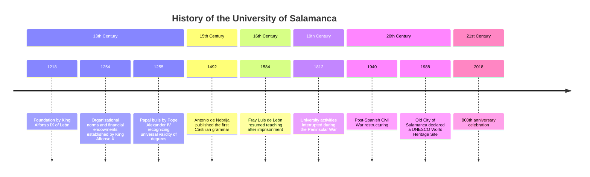

# Lab 5 (20/3/2025)
Hem estudiat enginyeria de prompting per poder crear prompts consistents i bons perquè els LLMs ho entenguin.
- Ser específic
- Ficar exemples
- Demanar alguna cosa
- Formatejar el prompt
- Demanar-li que ho faci pas per pas

Seguint aquestes directrius li hem demanat a un LLM que ens faci el codi Mermaid (format per a dissenyar grafs i diagrames des de text) de la *timeline* de la Universitat de Salamanca.

```
create Mermaid.js code to create a Timeline Diagram. this Timeline Diagram must reflect the history of the university of salamanca, and to do this you need to follow the following steps:

—
1. find a website like wikipedia and identify the most relevant events with their corresponding date
2. place the date of these events correctly in the Timeline Diagram using the date the event happened
3. place the corresponding century for each date
4. create the corresponding Mermaid.js code
—

write all the steps you are following to complete this task
```

I obtenim aquesta resposta:



Al RAG que teníem de pràctiques anteriors li hem afegit un glossari de termes de la FIB perquè a la hora de buscar sigles d'assignatures (DGSI) o de termes específics de la universitat (ECTS) entengui de què estem parlant. El link al projecte és el mateix que el lab anterior: [link](https://github.com/DGSI-UPC/llm-chat-rag).
