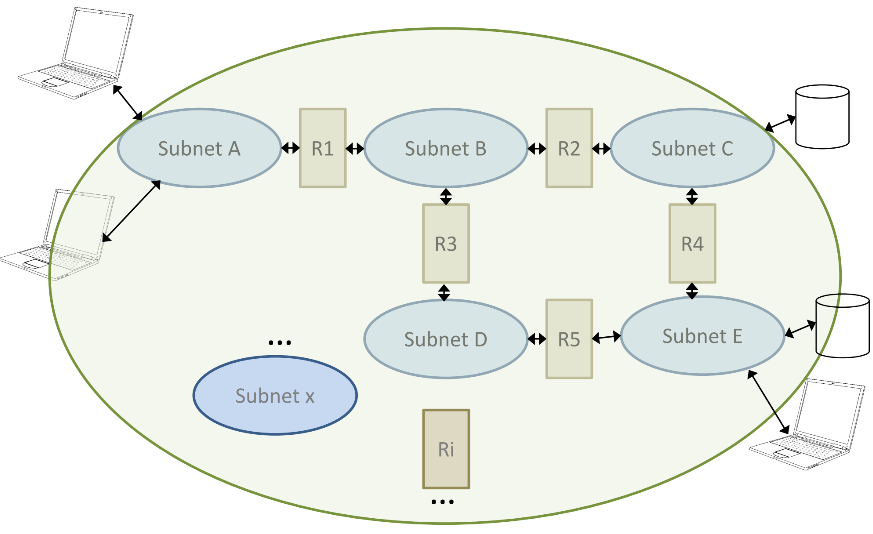

# Topic 1: Distributed Applications Design

**Teacher:** Jaime Delgado, DAC - UPC
**Semester:** 2024/25 Q2
**Course Code:** ISDCM - Topic 1

---

## 1. Applications (REMINDER)

### 1.1 The Internet

- **Definition**: A global network connecting millions of computers via routers.
- **Key Components**:
  - **Hosts**: End-user devices (e.g., computers, smartphones).
  - **Routers (Ri)**: Devices that forward data packets between networks.
- **Structure**:



### 1.2 Models and Communication
#### 1.2.1 Models

<table border="1">
  <thead>
    <tr>
      <th>OSI model</th>
      <th>Internet model</th>
    </tr>
  </thead>
  <tbody>
    <tr>
      <td><strong>Physical</strong>: Handles raw bit transmission over hardware.</td>
      <td><strong>Physical</strong>: Physical transmission medium.</td>
    </tr>
    <tr>
      <td><strong>Data Link</strong>: Manages node-to-node data transfer (e.g., Ethernet).</td>
      <td><strong>Network Access</strong>: Combines Data Link functionalities.</td>
    </tr>
    <tr>
      <td><strong>Network</strong>: Routes packets across networks (e.g., IP).</td>
      <td><strong>IP (Internet Protocol)</strong>: Routes datagrams across networks.</td>
    </tr>
    <tr>
      <td><strong>Transport</strong>: Ensures end-to-end communication (e.g., TCP, UDP).</td>
      <td><strong>Transport</strong>: TCP or UDP for reliable or fast data transfer.</td>
    </tr>
    <tr>
      <td><strong>Session</strong>: Manages sessions between applications.</td>
      <td rowspan="3"><strong>Application</strong>: Protocols like HTTP, FTP, SMTP..</td>
    </tr>
    <tr>
      <td><strong>Presentation</strong>: Translates data formats and handles encryption.</td>
    </tr>
    <tr>
      <td><strong>Application</strong>: Provides user interfaces and services (e.g., HTTP). Note: The Application, Presentation, and Session layers reside only in the host, not in intermediate network devices.</td>
    </tr>
  </tbody>
</table>


> **Comparison**:
>  - **Differences**: OSI and Internet models differ in layer count and structure. OSI has seven layers, while the Internet model has five. The Internet model's layers are not formalized as strictly as OSI.
>  - **Equivalences**:
    - OSI Transport layer is equivalent to Internet Transport (TCP/UDP), not TCP/UDP plus IP.
    - OSI Presentation and Session layers are part of the Internet Application layer.

- **Protocol Data Units (PDUs)**:
  - **Transport Segment**: 
    ```
    | T-H | Transport data |
    ```
    - T-H: Transport Header
  - **IP Datagram**: 
    ```
    | IP-H | IP data |
    ```
    - IP-H: IP Header
  - **Data Link Frame**: 
    ```
    | DL-H | IP-H | T-H | Application data | DL-T |
    ```
    - DL-H: Data Link Header, DL-T: Data Link Trailer
  - **Purpose**: Encapsulates data with headers/trailers at each layer for transmission.

- **Communication**: Hosts communicate through routers, with data encapsulated and de-encapsulated across layers.

### 1.3 MIME (Multipurpose Internet Mail Extensions)

- **Purpose**: Extends email to support non-ASCII data and multipart messages.
- **History**:
  - Introduced in RFCs 1341+1342 (1992), updated in 2045-2049 (1996), and beyond (e.g., RFC 6838, 2003).
  - Extends beyond email to HTTP and 7-bit environments.

- **Main Features**:
  - **Non-ASCII Data**: Uses all 8 bits for diverse content types.
  - **Multipart Messages**: Allows multiple content types in one message.

- **Header Elements**:
  - `MIME-Version`: Indicates MIME compliance (e.g., `1.0`).
  - `Content-Type`: Specifies data type (e.g., `text/plain`).
  - `Content-Transfer-Encoding`: Defines encoding method (e.g., `base64`).
  - `Content-ID`, `Content-Description`: Additional metadata.
  - Others: `Content-Disposition` (RFC 2183), `Content-Language` (RFC 3282).

- **Media Types**:
  - **Categories**: `application`, `audio`, `example`, `font`, `haptics`, `image`, `message`, `model`, `multipart`, `text`, `video`.
  - **Examples**:
    - `application/pdf`, `application/soap+xml`
    - `audio/mpeg`, `image/jpeg`, `text/html`
    - `multipart/mixed`, `video/mp4`
  - **Stats (January 2025)**: 911 standard + 1239 vendor subtypes = 2150 total (per IANA).

- **Content-Transfer-Encoding**:
  - **7-bit SMTP**: `7bit`, `quoted-printable`, `base64`.
  - **8-bit SMTP Extensions**: `8bit`, `binary` (RFC 1652, 6152).
  - **Base64**:
    - Converts 8-bit bytes to 6-bit values mapped to 64 ASCII characters (A-Z, a-z, 0-9, +, /).
    - Process: 3 bytes (24 bits) → 4 encoded characters (33% inefficiency).
    - Example Table:
      ```
      Value  Encoding
      0      A
      1      B
      ...
      62     +
      63     /
      ```

### 1.4 Web (WWW)

- **Definition**: A system of interlinked hypertext documents accessed via the Internet.
- **Key Elements**:
  - **Protocol**: HTTP (HyperText Transfer Protocol) for dialogue.
  - **Information Format**: HTML (HyperText Markup Language) for content.
  - **Links**: URI (Uniform Resource Identifier) for navigation.
    - **URL**: Locator (e.g., `http://www.example.com`).
    - **URN**: Name (e.g., `urn:example:animal:ferret:nose`).

- **URI Syntax** (RFC 3986, 2005):
  ```
  scheme ":" hier-part [ "?" query ] [ "#" fragment ]
  ```
  - Examples:
    - `foo://example.com:8042/over/there?name=ferret#nose`
    - `http://www.ac.upc.edu/etsetb/pam?name=http#get`

### 1.5 HTTP (HyperText Transfer Protocol)

- **Overview**: A stateless request-response protocol, typically over TCP port 80.
- **Versions**:
  - HTTP/0.9 (1991), HTTP/1.1 (RFC 2616, 1999; updated RFC 7230-7235, 2014; RFC 9110, 2022).
  - HTTP/2 (RFC 7540, 2015; RFC 9113, 2022) - Enhances performance.
  - HTTP/3 (emerging).

- **Methods**:
  - **No Modification**:
    - `GET`: Retrieves a resource.
    - `HEAD`: Like GET, but without the body.
    - `TRACE`: Echoes the request.
    - `OPTIONS`: Lists supported methods.
  - **Modification**:
    - `POST`: Submits data (e.g., forms, database updates).
    - `PUT`: Uploads a resource.
    - `DELETE`: Removes a resource.
    - `CONNECT`: Establishes a tunnel.
    - `PATCH`: Partial updates (RFC 5789, 2010).

- **Request Format**:
  ```
  GET /index.html HTTP/1.1
  Host: www.example.com
  
  [Body: Empty for GET]
  ```

- **Response Format**:
  ```
  HTTP/1.1 200 OK
  Content-Type: text/html
  
  [HTML document]
  ```

- **Status Codes**:
  - **1xx**: Informational (e.g., 100 Continue).
  - **2xx**: Success (e.g., 200 OK, 201 Created).
  - **3xx**: Redirection (e.g., 301 Moved Permanently).
  - **4xx**: Client Error (e.g., 404 Not Found).
  - **5xx**: Server Error (e.g., 500 Internal Server Error).

- **HTTP/2 Features**:
  - Does **not** change syntax.               
  - **Multiplexing**: multiple streams over one connection.
  - **Header Compression**: reduces overhead.
  - **Server Push**: proactive resource delivery (server does not need to receive a request in order to send a response).
  - **Frame Format**:
    ```
    Length (24) | Type (8) | Flags (8) | R | Stream Identifier (31)
    Frame Payload (0...)
    ```
  - **Frame Types**: `DATA`, `HEADER`, `PRIORITY`, `RST_STREAM`, `PING`, etc.

- **Examples**:
  - **GET Request**:
    ```
    GET /search?q=myBook HTTP/1.1
    Host: www.google.com
    Accept: text/html
    ```
  - **GET Response**:
    ```
    HTTP/1.1 200 OK
    Date: Fri, 17 Sep 2009 07:59:01 GMT
    Content-Type: text/html
    Content-Length: 2810
    ```

---

## 2. XML (eXtensible Markup Language) and JSON

### 2.1 XML

- **Purpose**: Designed for data interchange and storage (unlike HTML for display).
- **Versions**: XML 1.0 (5th Ed., 2008), XML 1.1 (2nd Ed., 2006) for Unicode support.
- **Structure**: 
  - Tree-based with **elements**, **attributes**, and **text**.
  - **Syntax Rules**:
    - Mandatory closing tags (e.g., `<tag></tag>`).
    - Case-sensitive tags.
    - Proper nesting (e.g., `<a><b></b></a>`).
    - Single root element required.
    - Attributes quoted (e.g., `attr="value"`).
    - **Tags can be defined by anyone**, not just Standards Development Organizations (SDOs).
- **Components**:
  - **Elements**: Structured data (e.g., `<title>XML Basics</title>`).
  - **Attributes**: Metadata or simple values (e.g., `lang="en"`).
  - **Text**: Content within elements (e.g., `XML Basics`).

- **Example**:
  ```xml
  <bookstore>
    <book category="COOKING">
      <title lang="en">Everyday Italian</title>
      <author>Giada De Laurentiis</author>
      <year>2005</year>
      <price>30.00</price>
    </book>
  </bookstore>
  ```
  > Contains elements (`book`, `title`, `author`, `year`), attributes (`lang`), and text (`XML`, `John Smith`, `2018`).

- **Namespaces**:
  - Prevent name conflicts using `xmlns` (e.g., `xmlns:prefix="URI"`).
  - Default namespace applies to elements without prefixes.
  - Syntax: `xmlns:prefix="URI"`
  - Example: `xmlns:xsi="http://www.w3.org/2001/XMLSchema-instance"`

- **XML Schema (XSD)**:
  - **Purpose**: Define the structure and data types of XML documents.
  - **Syntax**:
    - Written in XML, using XML Schema language (XSD).
    - Referenced in XML instances using `xsi:schemaLocation`.
  - Example of file `note.xsd`:
    ```xml
    <xs:schema xmlns:xs="http://www.w3.org/2001/XMLSchema">
      <xs:element name="note">
        <xs:complexType>
          <xs:sequence>
            <xs:element name="to" type="xs:string"/>
            <xs:element name="from" type="xs:string"/>
          </xs:sequence>
        </xs:complexType>
      </xs:element>
    </xs:schema>
    ```
  - **Instance of the schema**:
    ```xml
    <note xmlns:xsi="http://www.w3.org/2001/XMLSchema-instance" xsi:schemaLocation="note.xsd">
      <to>Tove</to>
      <from>Janis</from>
    </note>
    ```

  - **Types**:
    - **Simple Types**: `string`, `boolean`, `decimal`, `float`, etc.
    - **Derived Simple Types**: Restrictions like `minInclusive`, `pattern`.
    - **Complex Types**: Contain nested elements or attributes.

  - **Namespaces in Schemas**:
    - `targetNamespace`: Defines the namespace for elements in the schema (e.g., `http://www.films.org`).
    - Does not specify values; it provides identifiers for elements.
    - Example:
      ```xml
      <xsd:schema
        xmlns:xsd="http://www.w3.org/2001/XMLSchema"
        targetNamespace="http://www.films.org"
        xmlns="http://www.films.org">
      ```
      - Root element of a schema, defining namespaces.

- **XSLT (XSL Transformations)**:
  - **Purpose**: Transform XML into other formats (e.g., HTML, another XML schema).
  - **Example**:
    ```xml
    <?xml-stylesheet type="text/xsl" href="cdcatalog.xsl"?>
    <catalog>
      <cd><title>Empire Burlesque</title><artist>Bob Dylan</artist></cd>
    </catalog>
    ```
    ```xml
    <xsl:stylesheet version="1.0" xmlns:xsl="http://www.w3.org/1999/XSL/Transform">
      <xsl:template match="/">
        <html><body>
          <h2>My CD Collection</h2>
          <table border="1">
            <tr><th>Title</th><th>Artist</th></tr>
            <xsl:for-each select="catalog/cd">
              <tr><td><xsl:value-of select="title"/></td><td><xsl:value-of select="artist"/></td></tr>
            </xsl:for-each>
          </table>
        </body></html>
      </xsl:template>
    </xsl:stylesheet>
    ```

### 2.2 JSON (JavaScript Object Notation)

- **Purpose**: Lightweight data interchange format, easier to parse than XML.
- **Standard**: from IETF.
- **Structure**:
  - **Primitive Types**: `strings`, `numbers`, `booleans`, `null`.
  - **Structured Types**: 
    - **Objects**: Key-value pairs in `{}`.
    - **Arrays**: Ordered lists in `[]`.

- **Example**:
  ```json
  {
    "Image": {
      "Width": 800,
      "Height": 600,
      "Title": "View from 15th Floor",
      "Thumbnail": {
        "Url": "http://www.example.com/image/481989943",
        "Height": 125,
        "Width": 100
      },
      "Animated": false,
      "IDs": [116, 943, 234, 38793]
    }
  }
  ```

- **JSON Schema**: Validates JSON structure (similar to XSD).
  - Defined in RFC 8927 (2020) and https://json-schema.org/.

---

## 3. Web Services

This section provides in-depth coverage of web services, focusing on WSDL, SOAP, and REST, ensuring students can analyze and modify WSDL specifications.

### 3.1 Distributed Applications and Remote Operations

- **Concept**: Operations executed on remote servers via protocols.
- **Models**:
  - **Local**: Operations on the same machine.
  - **Distributed**: Client requests service from a remote server.

- **Technologies**:
  - **RPC**: Remote Procedure Call.
  - **RMI**: Java-specific RPC.
  - **CORBA**: Language-independent distributed objects.
  - **SOAP**: XML-based messaging.
  - **REST**: Lightweight, using HTTP methods.

### 3.2 Web Services Model

- **General Model**:
  - Client and server communicate via HTTP.
  - WSDL defines the service interface.
  - UDDI (Universal Description, Discovery, and Integration) was used for service discovery but is now deprecated.

[]()

### 3.3 WSDL (Web Services Definition/Description Language)

- **Purpose**: Describes web service operations, types, and bindings.
  - Used by providers to allow clients to access services remotely.
  - Defines operations for any service, not just REST.

- **Versions**:
  - **WSDL 1.1**:
    - Uses `definitions`, `portType`, `port`.
    - Example: `<definitions>` as the root element.
  - **WSDL 2.0**:
    - Uses `description`, `interface`, `endpoint`.
    - Example: `<description>` as the root element.
  - **Differences**:
    - Terminology: `portType` (1.1) vs. `interface` (2.0), `port` (1.1) vs. `endpoint` (2.0).
    - Syntax and structure changes, not just naming.

- **Structure**:
  1. **Namespaces**:
    - Define namespaces used for this connection.
    - Standard namespaces (e.g., `http://www.w3.org/ns/wsdl`, `http://www.w3.org/2001/XMLSchema`).
    - Specific namespaces (e.g., `http://www.bookstore.org/booklist/wsdl`).
    - Note that we are describing two new namespaces, tns and wsoap.
      ```xml
      <?xml version="1.0"?>
        <wsdl:description
          name="StockQuote"
          xmlns:wsdl="http://www.w3.org/ns/wsdl"
          targetNamespace="http://example.com/stockquote"
          xmlns:tns="http://example.com/stockquote"
          xmlns:wsoap="http://www.w3.org/ns/wsdl/soap">
            <slot/>
        </wsdl:description>
      ```
  2. **Types**:
    - Define data structures using XML schemas.
    - In example 1 we are simply describing a data type.
    - In example 2 we are creating a schema caslled xs for these data types so that in the future we can reuse them.
    - `<xs:all>` means that all children appear in any order.
      ```xml
      <!-- Example 1 -->
      <element name="getTermRequest">
          <element name="term" type="xs:string"/>
      </element>
      <element name="getTermResponse">
          <element name="value" type="xs:string"/>
      </element>

      <!-- Example 2 -->
      <wsdl:types>
        <xs:schema
            targetNamespace="http://example.com/stockquote"
            xmlns:xs="http://www.w3.org/2001/XMLSchema">
          <xs:element name="TradePriceRequest">
            <xs:complexType>
              <xs:all>
                <xs:element name="stockName" type="xs:string"/>
              </xs:all>
            </xs:complexType>
          </xs:element>
          <xs:element name="TradePriceResponse">
            <xs:complexType>
              <xs:all>
                <xs:element name="stockPrice" type="float"/>
            </xs:all>
            </xs:complexType>
          </xs:element>
        </xs:schema>
      </wsdl:types>
      ```
  3. **Interface/PortType**:
    - Define operations and their messages.
    - **Operations:** defined in `<portType>` (1.1) or `<interface>` (2.0).
    - Specify input, output, and fault messages.
      ```xml
      <wsdl:interface name="StockQuoteInterface">
        <wsdl:operation name="TradePrice"
          pattern="http://www.w3.org/ns/wsdl/in-out">
            <wsdl:input element="tns:TradePriceRequest"/>
            <wsdl:output element="tns:TradePriceResponse"/>
        </wsdl:operation>
      </wsdl:interface>
      ```

  4. **Binding**:
    - Specifies protocol (e.g., SOAP, HTTP).
      ```xml
      <wsdl:binding 
        name="StockQuoteBinding"
        interface="tns:StockQuoteInterface"
        type="http://www.w3.org/ns/wsdl/soap" wsoap:version="1.1" wsoap:protocol="http://www.w3.org/2006/01/soap11/bindings/HTTP/">
          <wsdl:operation ref="tns:TradePrice" wsoap:action="http://example.com/TradePrice"/>
      </wsdl:binding>
      ```
  5. **Service**:
    - Provides endpoint URL.
      ```xml
      <wsdl:service
        name="StockQuoteService"
        interface="tns:StockQuoteInterface">
        <wsdl:documentation>My first service</wsdl:documentation>
        <wsdl:endpoint
          name="StockQuoteEndPoint"
          binding="tns:StockQuoteBinding"
          address="http://example.com/endpoint/stockquote"/>
      </wsdl:service>
      ```

- **Attributes**:
  - **Message Exchange Patterns**:
    - Specifies message exchange pattern (e.g., `http://www.w3.org/ns/wsdl/in-out`).
    - Possible values:
      - `in-out`: we always receive a response.
      - `in-only`: we do not need to receive information. We do not know if there is an error after the execution but sometimes it is good because responses cause overhead.
      - `robust-in-only`: only answers if there was an error.
  - **wsdlx:safe**:
    - Indicates idempotence (no server modification).
    - Advantage for REST implementation due to statelessness.
  - **style**: Defines operation style (e.g., `http://www.w3.org/ns/wsdl/style/iri`).

- **Messages** (WSDL 1.1):
  - Define input/output parameters.
  - Example:
    ```xml
    <message name="SayHelloRequest">
      <part name="firstName" type="xsd:string"/>
    </message>
    ```

- **Key Points**:
  - WSDL defines operations for services, not just REST.
  - Bindings can be to SOAP, HTTP, or other protocols.
  - WSDL 2.0 uses `interface` instead of `portType`.
  - UDDI is deprecated and no longer widely used.

### 3.4 SOAP (Simple Object Access Protocol)

- **Purpose**: Exchanges structured XML messages over protocols.
- **Structure**:
  ```xml
  <env:Envelope xmlns:env="http://www.w3.org/2003/05/soap-envelope">
    <env:Header>...</env:Header>
    <env:Body>
      ...
      <env:Fault>...</env:Fault>
      ...
    </env:Body>
  </env:Envelope>
  ```

- **Message Exchange Patterns (MEPs)**:
  - `request-response`: Client sends request, server responds.
  - `soap-response`: Server sends response without a request (used in WSDL bindings).
  - Specified in binding (e.g., `wsoap:mep="http://www.w3.org/2003/05/soap/mep/soap-response"`).

- **Example Request**:
  ```
  POST /service HTTP/1.1
  Host: example.com
  Content-Type: application/soap+xml
  <?xml version="1.0"?>
    <env:Envelope>...</env:Envelope>
  ```

- The SOAP response is very similar to the request, the only thing that changes is the headers:
  ```
  HTTP/1.1 200 OK
  Content-Type: application/soap+xml; charset=utf-8
  Content-Length: 242
  ```

- **Key Points**:
  - SOAP is protocol-agnostic but often used with HTTP.
  - SOAP requests are typically sent with `POST` due to message content in the body.
  - Can be used with other protocols (e.g., SMTP).
  - More verbose than REST, requiring more bytes for requests.
  - Can connect to public web services.
  - Namespace: `http://www.w3.org/ns/wsdl/soap` identifies the WSDL SOAP Binding Namespace.

### 3.5 REST (Representational State Transfer)

- **Purpose**: Lightweight alternative to SOAP, using HTTP methods and URIs.
- **HTTP Methods**:
  - **GET**: Retrieve resource (idempotent, no server modification).
  - **POST**: Create or update resource (modifies server).
  - **PUT**: Update resource (modifies server).
  - **DELETE**: Remove resource (modifies server).

- **Example Request**:
  ```
  GET /stockquote/quote?ticker=IBM HTTP/1.1
  Host: example.com
  ```

- **Key Points**:
  - REST services can use any HTTP method, not just GET.
  - Parameters can be in the URL (e.g., query string) or body (for POST).
  - REST is stateless and often uses JSON for data interchange.
  - Can use SOAP for responses, though typically uses XML or JSON.
  - Suitable for operations marked as `wsdlx:safe="true"` due to idempotence.

### 3.6 WSDL and REST

- **Binding to HTTP**:
  - WSDL can define bindings directly to HTTP for RESTful services.
  - Example:
    ```xml
    <binding name="StockQuoteHTTPBinding" type="http://www.w3.org/ns/wsdl/http">
      <operation ref="tns:getQuote" whttp:method="GET"/>
    </binding>
    ```
  - Specifies HTTP methods (e.g., `GET`, `POST`) for operations.

- **REST Implementation**:
  - Use `GET` for read-only operations (e.g., `wsdlx:safe="true"`).
  - Use `POST` for operations that modify the server.
  - Parameters are passed in the URL or body (for POST).
  - Example URL: `http://www.bookstore.com/books/?subject=computers/eclipse`.
    - Valid for REST, specifying input parameters in the URL.

- **Key Points**:
  - WSDL can specify HTTP methods for REST operations.
  - `wsdlx:safe="true"` is advantageous for REST due to statelessness.
  - REST requests can be implemented with GET or POST, depending on modification criteria.
  - Happens the same as for JSON, REST is more simple but for very complex things we need to formalize it more to ensure it will work as intended and it will be interoperable.

### 3.7 Extending WSDL

- **Adding Operations**:
  - **Steps**:
    1. Define new types in `<types>` (e.g., using XML schemas).
    2. Add new messages (WSDL 1.1) or input/output elements (WSDL 2.0).
    3. Add new operations to the interface/portType.
    4. Update bindings and services as needed.
  - **Example (Adding `searchVideosByTitle`)**:
    - New types:
      ```xml
      <xs:element name="searchVideosByTitle">
        <xs:complexType>
          <xs:sequence>
            <xs:element minOccurs="0" name="title" nillable="true" type="xs:string"/>
          </xs:sequence>
        </xs:complexType>
      </xs:element>
      ```
    - New messages (WSDL 1.1):
      ```xml
      <message name="searchVideosByTitleRequest">
        <part element="ns:searchVideosByTitle" name="parameters"/>
      </message>
      ```
    - New operation:
      ```xml
      <portType name="FindServicePortType">
        <operation name="searchVideosByTitle">
          <input message="ns:searchVideosByTitleRequest"/>
          <output message="ns:searchVideosByTitleResponse"/>
        </operation>
      </portType>
      ```
    - Update bindings:
      ```xml
      <binding name="FindServiceHttpBinding" type="ns:FindServicePortType">
        <http:binding verb="POST"/>
        <operation name="searchVideosByTitle">
          <http:operation location="searchVideosByTitle"/>
        </operation>
      </binding>
      ```

- **Changing Bindings**:
  - To switch from SOAP to REST:
    - Change binding type to HTTP.
    - Specify HTTP methods (e.g., `GET` for read-only, `POST` for modifications).
  - Example (SOAP to REST):
    ```xml
    <binding name="BookListHTTPBinding" type="http://www.w3.org/ns/wsdl/http">
      <operation ref="tns:getBookList" whttp:method="GET"/>
    </binding>
    ```

- **Handling Faults**:
  - Define faults in `<interface>` or `<portType>`.
  - Example:
    ```xml
    <fault name="invalidDataFault" element="ghns:invalidDataError"/>
    ```
  - Specify fault handling in bindings (e.g., `wsoap:code="soap:Sender"`).

- **Namespaces and Schemas**:
  - Update namespaces for new operations (e.g., `xmlns:msg="http://www.bookstore.org/booklist/xsd"`).
  - Extend schemas for new types (e.g., `getSpecificBookDataType`).

- **Key Points**:
  - New operations require updates to types, messages, operations, and bindings.
  - Switching to REST involves binding to HTTP and specifying methods.
  - Faults and namespaces must be handled appropriately.